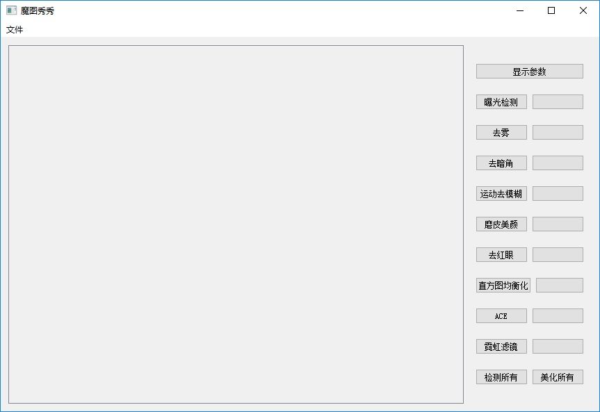
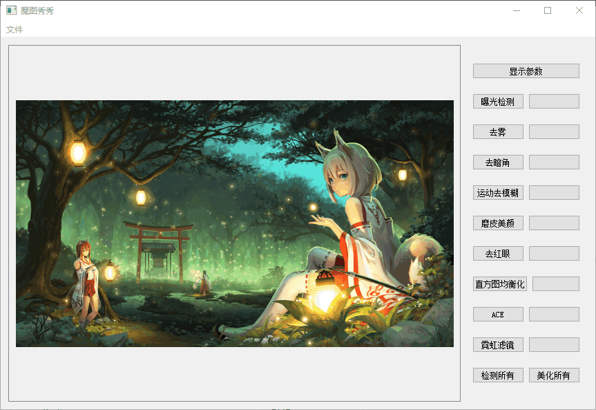

# MoTu
魔图秀秀——数字图像处理课程大作业  
作者：第七组全体成员  

---
## 一、介绍  
本程序运行于win10 x64系统上，依赖环境 Qt5.10、OpenCV3.4.4、Python3.6，使用 msvc2017 工具编译。由于发布的时候没有完全配好发布的依赖环境，所以可能部分电脑上无法运行本程序。

### 1.1 界面
  

### 1.2 图片加载
点击「文件」->「打开」，选择要加载显示的图片。
  
本程序会对图片进行自适应，避免了比例问题。同时支持滚轮缩放以及鼠标拖拽。

## 二、功能描述  
本次实现了曝光检测、去雾、去暗角、运动去模糊、磨皮美颜、去红眼、直方图均衡化、ACE以及霓虹滤镜共九种功能。  
首先每种功能均可单独使用，同时也使用了一个函数统一进行全部调用操作。其中直方图均衡化、ACE与霓虹滤镜没有包含进全部调用中。因为后三种算法考虑到自身的特殊性，没有设计检测算法，所以就没有集合进统一调用中而是由用户自己单独使用。  
在统一调用方面，我们会判断图片是否包含人脸，如果包含人脸，则部分算法将不予执行，因为部分算法不适合处理人脸图片。在统一修复图像方面这是根据统一检测的信息判断的。  
为了方便的观察图片的参数信息，还有一个显示参数的功能，可以显示图片的灰度直方图相关的信息，以及曝光程度和暗通道信息。 